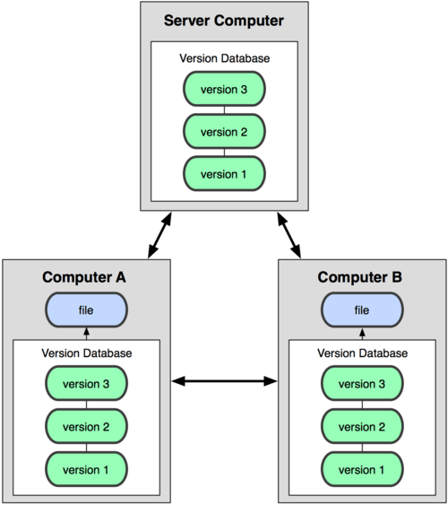

# Git vs SVN

### SVN
  
SVN은 `중앙 집중식 버전 관리 시스템 (Centeralized Version Control System)` 이다.  
`CVCS에선` 버전 관리가 되는 중앙 서버가 있고 중앙 서버에서 파일들을 `Checkout` 하는 다수의 클라이언트가 있다.  
이러한 구조는 중앙 서버가 잘못될 경우 모든 클라이언트가 잘못된다는 점이다.  
만약 서버가 다운될 경우 서버가 다시 복구 될 때까지 다른사람과의 협업이나 진행 중이던 작업의 버전관리 또한 어려워지게 된다.  
`Branch`를 나누었을 때 모든 `Branch`를 `Checkout`한다.  
  
### Git
  
Git은 `분산 버전 관리 시스템 (Distributed Version Control System)` 이다.  
DVCS에서는 클라이언트가 파일들의 마지막 Snapshot을 가져오는 대신 `Repository`를 통째로 복제한다.  
이 방법은 서버에 문제가 생겨도 로컬에서 버전 관리가 진행되기 때문에 서버가 다운된 동안에도 작업이 가능하고 다시 복구가 되면 작업했던 내용들을 서버로 `push`하면 된다.  
또한 서버가 폭파되어도 사용자들의 로컬 `Repository`를 통해서 복구가 가능하다.  
`Branch`를 나누었을 때 지정한 `Branch`만 `clone`한다.  