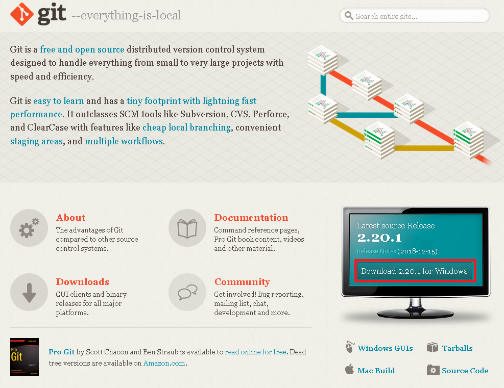
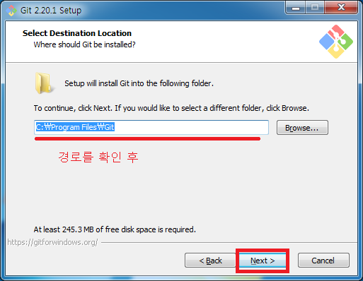
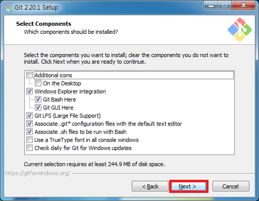
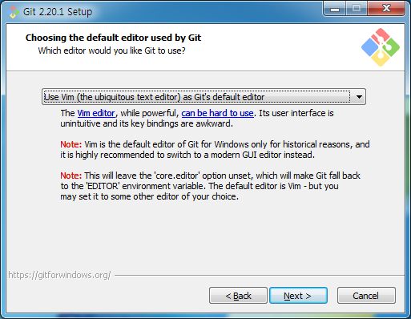
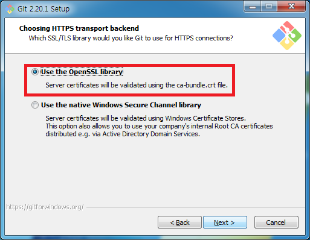
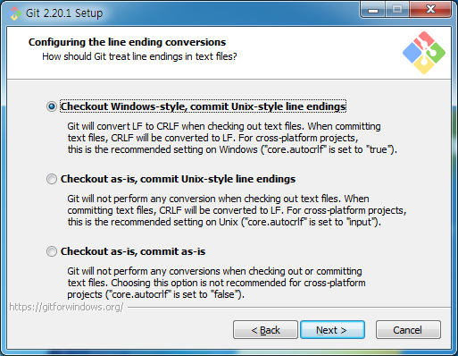
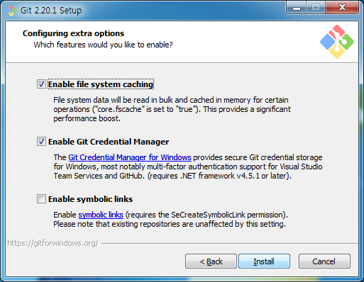

# Git 설치
https://git-scm.com/ 에 접속하여.  
  
빨간색으로 표시한 Download 뭐시기어쩌구를 클릭한다.  
그러면 Install 프로그램이 다운로드 된다.  
  
  
다운받은 Install 프로그램의 아이콘을 더블클릭한다.  
  
  
Git은 [GPL v2](http://www.gnu.org/licenses/old-licenses/gpl-2.0.txt) 라이센스를 따른다.  
  
  
설치하고 싶은 경로를 설정해준 후 Next  
  
  
기본 설치 옵션이 최고다.  
Next  
  
  
Next  

  
Git에서 사용할 기본 에디터를 설정하는 창이다.  
나중에 rebase나 commit들을 수정할 때 사용하게 되니 자신이 편한 에디터를 선택해주면 된다.  
  
  
Next  
  
  
OpenSSL을 사용하자  
  
  
line ending style을 골라주면 된다.  
  
  
Git Bash가 돌아갈 기본환경 설정이다.  
보통 MinTTY를 많이 사용한다.  
  
  
Next  
  
  
설치중...  
  
  
완료  