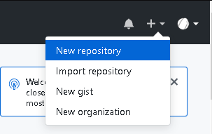
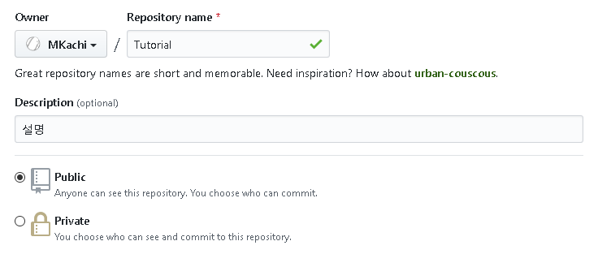

# Github
Git 프로젝트를 지원하는 웹호스팅 서버이다.  
  
### 회원가입
https://github.com/  
위의 링크로 접속하여 상단의 SingUp을 누른다.  
  
계정 정보를 입력해주고 Create an Account를 눌러준다.  
  
### Repository 생성
  
로그인을 한 뒤 상단 메뉴에서 New Repository를 누른다.  
  
  
Repository Name에 생성하려는 `Repository`의 이름을 적는다.  
Description은 생성하는 `Repository`의 설명을 적는 곳인데 굳이 적지 않아도 된다.  
public으로 생성할 경우 Github에서 다른 사용자들이 이 `Repository`를 볼 수 있다.  
private로 생성할 경우 `Repository`의 주인과 권한이 있는 사람들만 이 `Repository`를 볼 수 있다.  
  
`Initialize this repository with a README` 옵션은 이 Repository의 첫 페이지에 보이는 `README` 파일을 자동으로 생성하는 옵션이다.  
이 문서는 `Markdown`문법으로 작성되어야 한다.  
  
예)  
  
`Add .gitignore`는 뒤에서 설명하겠다.  
`Add a license`는 Repository에 있는 소스가 따를 라이센스 정책을 선택하는 것이다.  
라이센스를 선택할 경우 라이센스에 따른 `LICENSE` 파일을 생성해준다.  
  
  
필요한 옵션들을 선택하고 Create Repository를 누르면 Repository가 만들어진다.  
`MIT License`를 선택하여 `LICENSE`파일이 생성되었고 `Initialize this repository with a README`를 체크하여 `README.md` 파일 또한 생성되었다.  