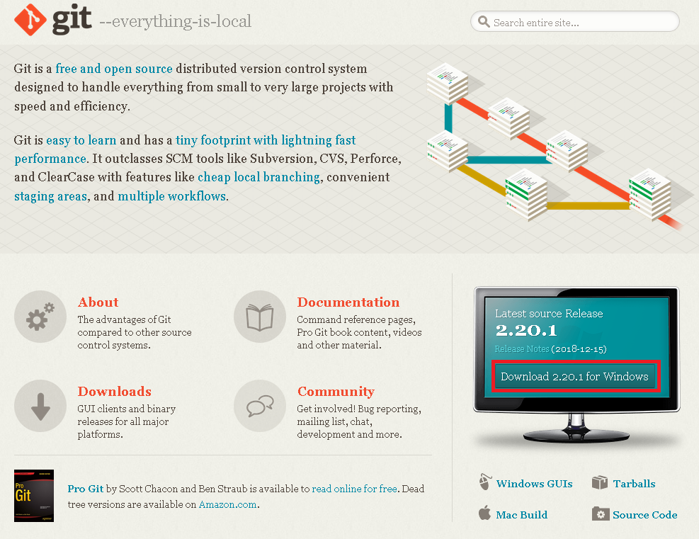

# Remote
우선 뒤쪽 내용에서 만들었던 `Repository`는 `Local Repository`라고 한다.  
  
이 곳에서 아무리 `commit`을 해도 Github에 만들어둔 `Repository`에는 올라가지 않는다.  
그래서 `Remote`명령을 통해 `Github`같은 곳에 만든 `Repository`를 `Local Repository`와 연결하는 것이다.  
  
### Remote 명령을 사용
``` bash
git init
git remote add [branch] [url]
```
원하는 폴더에서 `git init`을 통해 `Local Repository`를 생성한 후  
`git remote add origin [url]`로 연결하면 된다.  
  
예)  
``` bash
git remote add origin https://github.com/mkachi/Tutorial
```
  
  
아까 생성하였던 `README.md`나 `LICENSE`파일이 보이지 않는 것은 아직 `Repository`를 연결해줬을 뿐이지 `Github`에 있는 `Repository`를 `Checkout`하지 않은 상태이다.  

### Pull & Checkout
``` bash
git pull
git checkout [branch]
```
위와 같은 명령어를 통해 branch를 선택해 `checkout` 받을 수 있다.  
[branch]에는 master를 적으면 된다.  
master는 기본적으로 생성되는 `branch`이다.  
이 명령들은 뒤의 내용에서 더 자세히 설명할 것이다.  